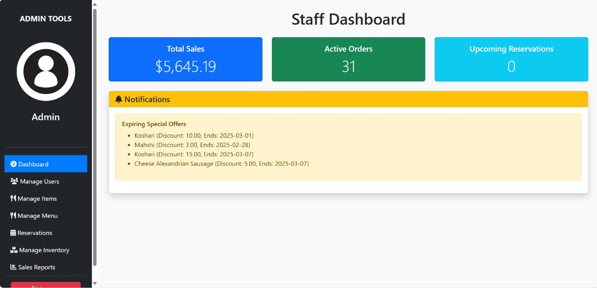
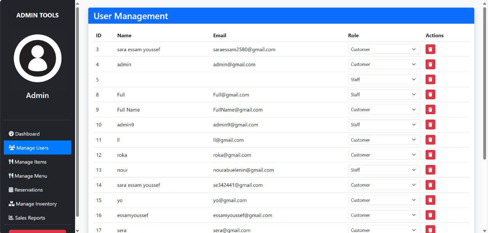
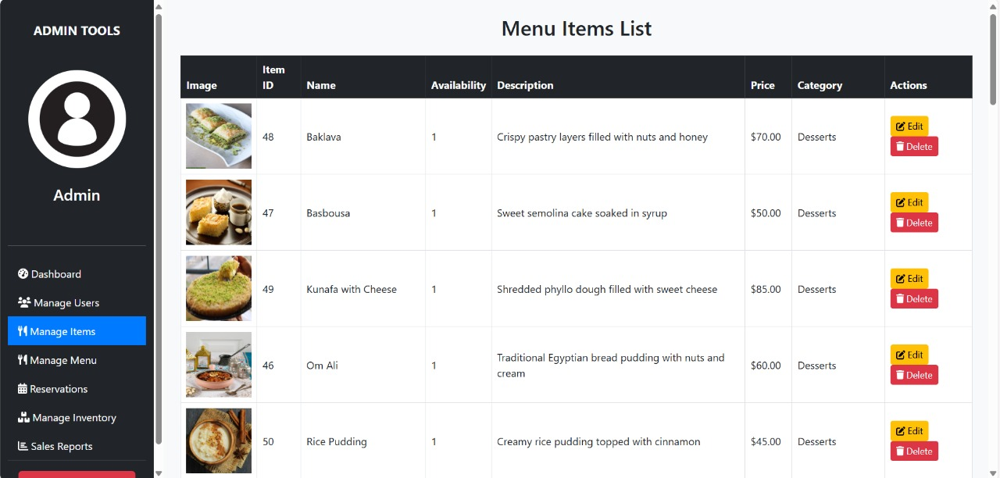
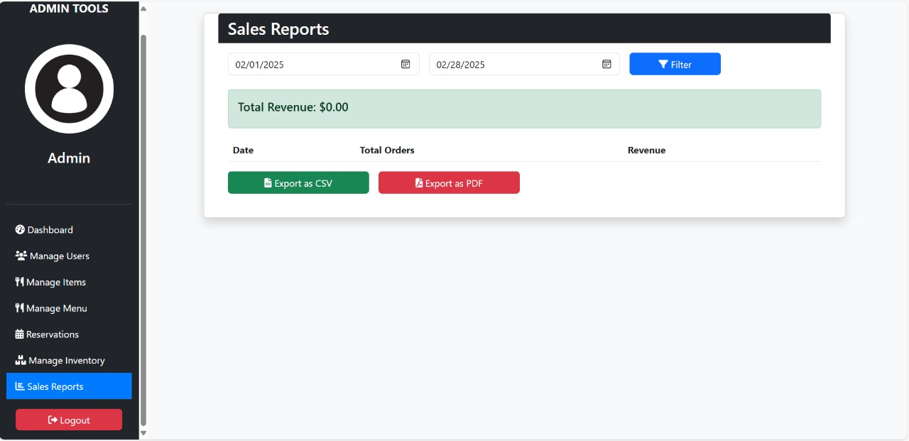

# Egyptian-Bites 🍽️

Welcome to **Egyptian-Bites**, a comprehensive web-based restaurant management system designed to streamline operations for modern dining establishments. Manage users, menus, inventory, orders, reservations, and more with an intuitive dashboard and robust backend.

## Features 🌟

- **User Management:**
  - Secure login for staff and administrators.
  - Role-based access for managing users and permissions.
  - Edit, delete, and update user information easily.

- **Menu & Special Offers:**
  - Add, edit, and delete menu items and categories.
  - Upload images for menu items.
  - Create and manage special offers with discount types and validity dates.

- **Inventory Management:**
  - Track stock levels and set reorder thresholds.
  - Add new items and manage existing inventory seamlessly.

- **Dashboard & Reports:**
  - View key metrics such as total sales, active orders, and upcoming reservations.
  - Generate detailed sales reports with export options (CSV and PDF).

- **Reservations:**
  - Manage customer reservations with real-time status updates.
  - Confirm or cancel reservations through an interactive interface.

## How to Use 

1. **Admin Login:**
   - Navigate to the admin login page and sign in with your credentials.
2. **Manage Users:**
   - Use the user management panel to update roles, delete users, or add new staff.
3. **Update Menu:**
   - Access the menu management section to add new dishes, update descriptions, and change images.
4. **Track Inventory:**
   - Monitor stock levels, add items, and set reorder alerts in the inventory management section.
5. **View Reports:**
   - Filter sales data by date and export reports to CSV or PDF.
6. **Handle Reservations:**
   - Confirm or cancel customer reservations directly from the dashboard.

## Screenshots 

### Extended Gallery
- **Home Page:**  
  
- **Login Screen:**  
  
  - **User Registration Page:**  
  
- **Detailed Menu View:**  
  
- **Reservation Generation Page:**  
  
- **Order Processing:**  
  
- **Special Offers Display:**  
  
- **Items Update Screen:**  
  
- **User Profile:**  
  
  - **Reservation Management:**  
  

### Core Functionality
- **Dashboard Overview:**  
  
- **User Management:**  
  
- **Menu Management:**  
  
- **Inventory & Reports:**  
  

## Installation 🛠️

1. **Clone the Repository:**
   ```bash
   git clone https://github.com/Jamal-Aldeen/Egyptian-Bites.git
   cd Egyptian-Bites
   ```
2. **Setup the Environment:**
   - Ensure you have PHP, MySQL, and a web server (Apache) installed.
   - Import the provided SQL schema to initialize your database.
3. **Configuration:**
   - Update the database credentials in the `/config/db.php` file.
   - Set proper permissions for the `/public/uploads/` directory to allow file uploads.
4. **Launch the Application:**
   - Configure your web server to serve the project directory.
   - Open your browser and navigate to your project URL (e.g., `http://localhost/Egyptian-Bites`).

## Technologies Used 💻

- **PHP**: Server-side processing and backend logic.
- **MySQL**: Database management for storing user, order, and inventory data.
- **Bootstrap 5**: Responsive design and styling.
- **JavaScript (AJAX)**: Dynamic content updates and interactive features.
- **HTML5 & CSS3**: Structure and presentation of the web application.

## Acknowledgments 🙏

- **Assets:** All images, icons, and design elements are either custom-created or sourced from free-to-use resources.
- **Inspiration:** Developed with inspiration from modern restaurant management solutions and designed to provide an all-in-one management experience.
